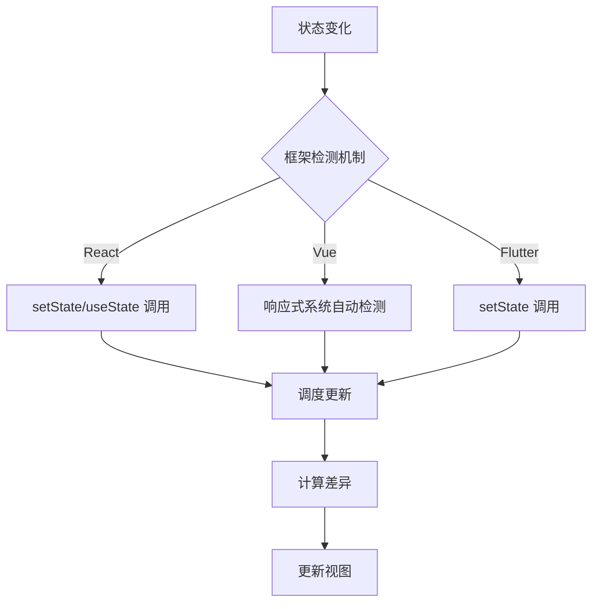
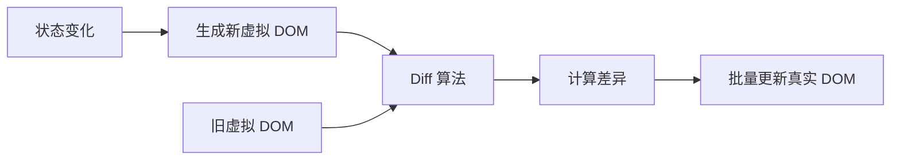

# React、Vue、Flutter 三种框架核心概念深度剖析

## 导读

**本文将深入剖析 React、Vue、Flutter 三种主流前端框架的核心概念，通过横向对比和纵向深挖，理解现代前端框架的设计思想。看似差异巨大的前端框架，真的差异巨大吗？**

下面我将从八个前端框架核心概念（我自认为的）的角度进行分析：
- 组件化架构
- 状态管理
- 数据驱动视图
- 生命周期管理
- 事件处理系统
- 虚拟 DOM 与渲染抽象
- Props 传递机制
- 路由管理

## 一、组件化架构：万物皆组件的不同实现

### 共同背景

组件化是现代前端框架的基石。它解决了传统开发中代码复用困难、维护成本高的问题。无论是一个按钮、一个表单，还是整个页面，都可以封装成独立的组件单元。

### React：函数即组件（现代）

React 采用了极简的组件定义方式，组件本质上就是一个返回 JSX 的函数或类。

```javascript
// 函数组件（推荐）
function Button({ text, onClick }) {
  return <button onClick={onClick}>{text}</button>;
}

// 类组件（传统方式）
class Button extends React.Component {
  render() {
    return <button onClick={this.props.onClick}>{this.props.text}</button>;
  }
}
```

React 的核心理念：
- 组件是纯函数：相同的 props 输入，产生相同的 UI 输出
- JSX 语法：将 HTML 结构直接写在 JavaScript 中
- 单向数据流：数据从父组件流向子组件

### Vue：单文件组件的优雅

Vue 采用单文件组件（SFC）的方式，将模板、逻辑、样式集中在一个 .vue 文件中。

```vue
<template>
  <button @click="handleClick">{{ text }}</button>
</template>

<script setup>
import { defineProps } from 'vue';

const props = defineProps({
  text: String,
  onClick: Function
});

const handleClick = () => {
  props.onClick?.();
};
</script>

<style scoped>
button {
  padding: 8px 16px;
  border-radius: 4px;
}
</style>
```

Vue 的核心理念：
- 关注点分离：模板、逻辑、样式分离但集中管理
- 模板语法：基于 HTML 的声明式模板
- 双向数据流：通过 v-model 支持双向绑定

### Flutter：一切皆 Widget

Flutter 采用 Widget 树的方式构建 UI，所有的 UI 元素都是 Widget。

```dart
// 无状态 Widget
class MyButton extends StatelessWidget {
  final String text;
  final VoidCallback onPressed;

  const MyButton({
    Key? key,
    required this.text,
    required this.onPressed,
  }) : super(key: key);

  @override
  Widget build(BuildContext context) {
    return ElevatedButton(
      onPressed: onPressed,
      child: Text(text),
    );
  }
}

// 有状态 Widget
class Counter extends StatefulWidget {
  @override
  _CounterState createState() => _CounterState();
}

class _CounterState extends State<Counter> {
  int count = 0;

  @override
  Widget build(BuildContext context) {
    return Column(
      children: [
        Text('Count: $count'),
        MyButton(
          text: 'Increment',
          onPressed: () => setState(() => count++),
        ),
      ],
    );
  }
}
```

Flutter 的核心理念：
- 一切皆 Widget：UI、布局、交互都是 Widget
- 不可变性：Widget 是不可变的，状态变化通过重建实现
- 组合优于继承：通过组合小 Widget 构建复杂 UI

### 总结及补充
**不同的组件化架构设计带来的不仅是写法上的差异，更深刻影响框架的其他设计决策（状态管理、渲染机制、性能优化、开发体验等几乎所有方面）**

#### React：函数式组件 → 函数式思维贯穿始终

因为组件是函数，React 的整体设计都体现函数式编程思想：

```javascript
// 1. 状态管理：函数式更新
const [count, setCount] = useState(0);
setCount(prev => prev + 1); // 不可变数据，函数式更新

// 2. 生命周期：副作用管理
useEffect(() => {
  // 副作用逻辑
  return () => {
    // 清理函数
  };
}, []); // 依赖数组

// 3. 性能优化：缓存机制
const memoValue = useMemo(() => compute(a, b), [a, b]);
const memoCallback = useCallback(() => doSomething(), []);
```

函数式组件决定：
- 状态管理必须显式（Hooks）：函数组件每次渲染都是新的函数调用，无法在函数内部持久化状态，必须依赖外部机制（Hooks）
- 生命周期变成副作用管理：因为没有实例，函数组件没有 this，没有实例方法，生命周期必须通过 Hooks 模拟，生命周期管理随之变成副作用管理
- 每次渲染都是新函数调用，需要手动缓存优化
- 更容易实现可中断渲染（Fiber 架构）：函数式组件天然无状态，容易实现可中断、可恢复的渲染过程

#### Vue：模板组件 → 编译时优化成为可能

因为模板是静态的，所以 Vue 可以在编译时做激进的优化：

```vue
<template>
  <div>
    <h1>{{ title }}</h1>
    <p>Static content</p>
    <button @click.stop.prevent="handleClick">点击</button>
  </div>
</template>

<script setup>
// 响应式自动追踪
const title = ref('Hello');
title.value = 'World'; // 直接修改，自动更新

// computed 自动缓存
const double = computed(() => count.value * 2);
</script>
```

模板式组件决定：
- 响应式系统可以自动追踪依赖：模板语法是声明式的，编译器可以直接对模板静态分析数据使用情况，建立精确的依赖关系
- 可以进行激进的编译时优化：编译器可区分静态/动态内容，做静态提升、补丁标记等优化
- 丰富的事件修饰符（.stop、.prevent）：模板编译器可以识别修饰符并生成对应代码，JSX 无法做到这一点
- 学习曲线更低：声明式的开发方式与HTML十分相似

**补充：Vue 编译时优化详解：**

Vue 的模板是静态的，编译器可以在编译阶段分析模板结构，识别哪些内容永远不会变化（静态），哪些内容会随数据变化（动态），从而进行针对性优化。

1. **静态提升（Static Hoisting）**

将永远不会改变的内容提升到渲染函数外部，避免每次渲染都重新创建：

```vue
<!-- 原始模板 -->
<template>
  <div>
    <h1>Static Title</h1>
    <p>Static paragraph</p>
    <span>{{ dynamicText }}</span>
  </div>
</template>

<!-- 编译后（简化） -->
<script>
// 静态内容被提升到渲染函数外部，只创建一次
const _hoisted_1 = createVNode("h1", null, "Static Title")
const _hoisted_2 = createVNode("p", null, "Static paragraph")

function render() {
  return createVNode("div", null, [
    _hoisted_1,  // 复用，不重新创建
    _hoisted_2,  // 复用，不重新创建
    createVNode("span", null, dynamicText)  // 动态内容每次创建
  ])
}
</script>
```

**优化效果**：
- 静态内容只创建一次，后续渲染直接复用
- 减少内存分配和垃圾回收压力
- 提升渲染性能

2. **补丁标记（Patch Flags）**

为动态节点打上标记，告诉运行时这个节点的哪些部分是动态的：

```vue
<!-- 原始模板 -->
<template>
  <div>
    <p>{{ message }}</p>
    <p class="static">Static content</p>
    <p :class="dynamicClass">{{ text }}</p>
  </div>
</template>

<!-- 编译后（简化） -->
<script>
function render() {
  return createVNode("div", null, [
    createVNode("p", null, message, 1 /* TEXT */),  // 标记：只有文本是动态的
    _hoisted_1,  // 完全静态，提升
    createVNode("p", { class: dynamicClass }, text, 3 /* TEXT | CLASS */)  // 标记：文本和class都是动态的
  ])
}
</script>
```

**补丁标记类型**：
```javascript
const PatchFlags = {
  TEXT: 1,           // 动态文本内容
  CLASS: 2,          // 动态 class
  STYLE: 4,          // 动态 style
  PROPS: 8,          // 动态属性（非 class/style）
  FULL_PROPS: 16,    // 有动态 key 的属性
  HYDRATE_EVENTS: 32,// 有事件监听器
  STABLE_FRAGMENT: 64,// 子节点顺序不变的 fragment
  KEYED_FRAGMENT: 128,// 有 key 的 fragment
  UNKEYED_FRAGMENT: 256,// 没有 key 的 fragment
  NEED_PATCH: 512,   // 需要 patch
  DYNAMIC_SLOTS: 1024,// 动态插槽
  HOISTED: -1,       // 静态节点
  BAIL: -2           // diff 算法应该退出优化模式
}
```

**优化效果**：
- 更新时只检查有标记的动态部分
- 跳过静态内容的 diff 比较
- 精确更新，性能大幅提升

3. **块级树优化（Block Tree）**

将模板分成多个"块"，每个块只追踪自己的动态节点：

```vue
<!-- 原始模板 -->
<template>
  <div>
    <header>
      <h1>{{ title }}</h1>
    </header>
    <main>
      <p>Static intro</p>
      <p>{{ content }}</p>
    </main>
    <footer>
      <span>Static footer</span>
    </footer>
  </div>
</template>

<!-- 编译后的块结构（概念） -->
<script>
// Block 只追踪动态节点
function render() {
  return (openBlock(), createBlock("div", null, [
    // 只有 title 和 content 被追踪
    dynamicNodes: [
      h1_with_title,  // 动态
      p_with_content  // 动态
    ]
  ]))
}
</script>
```

**优化效果**：
- 更新时只遍历动态节点数组，不需要遍历整个树
- 时间复杂度从 O(n) 降低到 O(动态节点数)

4. **静态属性提升**

将静态属性对象提升到渲染函数外部：

```vue
<!-- 原始模板 -->
<template>
  <div class="container" id="app" data-v-123>
    <p :class="dynamicClass">{{ text }}</p>
  </div>
</template>

<!-- 编译后 -->
<script>
// 静态属性对象被提升
const _hoisted_1 = {
  class: "container",
  id: "app",
  "data-v-123": ""
}

function render() {
  return createVNode("div", _hoisted_1, [
    createVNode("p", { class: dynamicClass }, text)
  ])
}
</script>
```

5. **预字符串化（Pre-Stringified）**

对于大量连续的静态节点，直接生成 HTML 字符串：

```vue
<!-- 原始模板 -->
<template>
  <div>
    <p>Line 1</p>
    <p>Line 2</p>
    <p>Line 3</p>
    <!-- ... 20 个静态 p 标签 -->
    <p>{{ dynamic }}</p>
  </div>
</template>

<!-- 编译后 -->
<script>
// 静态内容直接转为 HTML 字符串
const _hoisted_1 = createStaticVNode(
  "<p>Line 1</p><p>Line 2</p><p>Line 3</p>...",
  20  // 节点数量
)

function render() {
  return createVNode("div", null, [
    _hoisted_1,  // 静态 HTML 字符串
    createVNode("p", null, dynamic)
  ])
}
</script>
```

**React 为什么做不到这些优化？**

React 使用 JSX，本质是 JavaScript 表达式：

```javascript
// React JSX
function Component() {
  return (
    <div>
      <h1>Static Title</h1>
      <span>{dynamicText}</span>
    </div>
  )
}

// 编译后
function Component() {
  return React.createElement("div", null,
    React.createElement("h1", null, "Static Title"),  // 每次都创建
    React.createElement("span", null, dynamicText)
  )
}
```

**React 的限制**：
- JSX 是运行时执行的 JavaScript，编译器无法区分静态/动态
- 每次渲染都会重新执行整个函数，重新创建所有元素
- 无法在编译时做静态分析和优化
- 必须依赖运行时的 diff 算法（Fiber）

#### Flutter：Widget 不可变 → 分层架构 + 跨平台

因为 Widget 不可变，Flutter 必须采用分层架构：

```dart
// Widget 不可变（配置）
class MyButton extends StatelessWidget {
  final String text; // final：不可变
  
  const MyButton({required this.text}); // const 构造函数
  
  @override
  Widget build(BuildContext context) {
    return ElevatedButton(child: Text(text));
  }
}

// 状态必须分离到 State 对象
class Counter extends StatefulWidget {
  @override
  _CounterState createState() => _CounterState();
}

class _CounterState extends State<Counter> {
  int count = 0; // 状态在 State 中
  
  @override
  Widget build(BuildContext context) {
    return Text('$count'); // Widget 每次重建
  }
}
```

不可变决定：
- 状态与 Widget 必须分离（StatefulWidget + State）：Widget 是配置信息（不可变），State 是可变状态，必须分离
- 三棵树架构（Widget → Element → RenderObject）：Widget 不可变意味着每次更新都创建新 Widget，必须有 Element 层来复用和管理
- const 优化成为可能（编译时常量）：不可变性使得编译时常量成为可能，大幅减少对象创建
- 不依赖平台组件，可以自绘（Skia 引擎）：Widget 不依赖平台原生组件，可以完全自绘，实现像素级一致性
- 实现真正的跨平台像素级一致性

**补充：关于“不可变”的详解：**

Flutter 的核心设计哲学是 **Widget 不可变**

1. **状态与 Widget 必须分离**

因为 Widget 是不可变的（所有属性都是 final），状态变化时无法修改 Widget，只能创建新的 Widget。因此，可变的状态必须存储在单独的 State 对象中。

```dart
// Widget：不可变的配置信息
class Counter extends StatefulWidget {
  final String title;  // final：不可变
  
  const Counter({required this.title});  // const 构造函数
  
  @override
  _CounterState createState() => _CounterState();
}

// State：可变的状态容器
class _CounterState extends State<Counter> {
  int count = 0;  // 可变状态
  
  void increment() {
    setState(() {
      count++;  // 修改状态
    });
  }
  
  @override
  Widget build(BuildContext context) {
    // 每次 setState 都会重新调用 build
    // 创建新的 Widget 树
    return Column(
      children: [
        Text(widget.title),  // 访问 Widget 的不可变属性
        Text('Count: $count'),  // 访问 State 的可变状态
        ElevatedButton(
          onPressed: increment,
          child: Text('Increment'),
        ),
      ],
    );
  }
}
```

**为什么要这样设计？**

```dart
// 如果 Widget 可变（假设）
class Counter extends Widget {
  String title;  // 可变
  int count;     // 可变
  
  void increment() {
    count++;  // 直接修改
    // 问题：框架如何知道需要重新渲染？
    // 问题：如何追踪哪些属性变了？
    // 本质其实就是为了，方便区分可变与不可变，方便进行分类处理
  }
}

// Widget 不可变的好处
class Counter extends StatefulWidget {
  final String title;  // 不可变
  
  // 优势1：配置信息清晰，不会被意外修改
  // 优势2：可以安全地在多处复用
  // 优势3：便于进行 const 优化
}
```

2. **三棵树架构：Widget → Element → RenderObject**

因为 Widget 不可变，每次更新都会创建全新的 Widget 树。如果直接渲染 Widget，性能会很差。因此 Flutter 引入了三棵树架构。

```dart
// 三棵树的职责分工

// 1. Widget 树：配置信息（不可变，轻量级）
class MyApp extends StatelessWidget {
  @override
  Widget build(BuildContext context) {
    return Container(
      child: Text('Hello'),
    );
  }
}

// 每次 setState 都会创建新的 Widget 树：
// Container -> Text
// Container -> Text  (新的对象)
// Container -> Text  (又是新的对象)

// 2. Element 树：Widget 的实例化（可变，中间层）
// Element 负责：
// - 持有 Widget 的引用
// - 管理子 Element
// - 复用逻辑（关键！）
abstract class Element {
  Widget widget;  // 持有当前 Widget
  Element? parent;
  
  void update(Widget newWidget) {
    // 对比新旧 Widget
    if (widget.runtimeType == newWidget.runtimeType &&
        widget.key == newWidget.key) {
      // 可以复用！只更新引用
      widget = newWidget;
      // 递归更新子节点
    } else {
      // 不能复用，需要重建
      rebuild();
    }
  }
}

// 3. RenderObject 树：实际渲染（可变，重量级）
// RenderObject 负责：
// - 布局计算
// - 绘制
// - 命中测试
abstract class RenderObject {
  void layout() { /* 计算大小和位置 */ }
  void paint() { /* 绘制到画布 */ }
}
```

**三棵树的工作流程**：

```dart
// 场景：点击按钮，count 从 0 变为 1

// 步骤1：setState 触发
setState(() => count++);

// 步骤2：build 方法被调用，创建新的 Widget 树
Widget build(BuildContext context) {
  return Column(
    children: [
      Text('Count: $count'),  // 新的 Text Widget
      ElevatedButton(...)     // 新的 Button Widget
    ],
  );
}

// 步骤3：Element 树对比新旧 Widget
// Element 发现：
// - Column 类型没变 → 复用 ColumnElement
// - Text 类型没变，但内容变了 → 复用 TextElement，更新内容
// - Button 没变 → 复用 ButtonElement

// 步骤4：只有变化的部分才会触发 RenderObject 更新
// - TextRenderObject.markNeedsLayout()  // 标记需要重新布局
// - TextRenderObject.markNeedsPaint()   // 标记需要重新绘制

// 步骤5：渲染管线执行
// - Layout：计算 Text 的新尺寸
// - Paint：重新绘制 Text
// - Composite：合成到屏幕
```

**为什么需要三棵树？**

```dart
// 如果只有 Widget 树（没有 Element 层）
setState(() => count++);

// 问题1：每次都要重新创建所有 RenderObject
// - 创建 RenderColumn
// - 创建 RenderText
// - 创建 RenderButton
// 性能：非常差，大量对象创建和销毁

// 有了 Element 层
setState(() => count++);

// Element 层做智能复用：
// - RenderColumn：复用 ✓
// - RenderText：复用 ✓（只更新文本）
// - RenderButton：复用 ✓
// 性能：优秀，只更新必要的部分
```

3. **const 优化：编译时常量**

因为 Widget 不可变，可以使用 const 构造函数创建编译时常量，永远不会重建。

```dart
class MyWidget extends StatelessWidget {
  @override
  Widget build(BuildContext context) {
    return Column(
      children: [
        // 没有 const：每次 build 都创建新对象
        Text('Static Text'),
        
        // 有 const：编译时创建，永远复用同一个对象
        const Text('Static Text'),
        
        // 动态内容：无法使用 const
        Text('Count: $count'),
      ],
    );
  }
}
```

**const 优化的威力**：

```dart
// 场景：一个复杂的静态布局
class ComplexLayout extends StatelessWidget {
  @override
  Widget build(BuildContext context) {
    return const Column(
      children: [
        const Padding(
          padding: const EdgeInsets.all(16),
          child: const Text('Title'),
        ),
        const Divider(),
        const Padding(
          padding: const EdgeInsets.all(16),
          child: const Text('Content'),
        ),
      ],
    );
  }
}

// 没有 const：
// - 每次 build 创建 7 个对象（Column, 2个Padding, 2个Text, Divider, EdgeInsets）
// - 每秒 60 次重建 = 420 个对象/秒

// 有 const：
// - 编译时创建 1 次，永远复用
// - 每秒 60 次重建 = 0 个对象/秒
// 性能提升：无限大（从 420 降到 0）
```

**const 的深层原理**：

```dart
// 编译时
const text1 = const Text('Hello');
const text2 = const Text('Hello');

print(identical(text1, text2));  // true！同一个对象

// 运行时
final text3 = Text('Hello');
final text4 = Text('Hello');

print(identical(text3, text4));  // false，不同对象
```

4. **自绘引擎：不依赖平台组件**

因为 Widget 是纯 Dart 对象，不依赖平台原生组件，Flutter 可以完全自己绘制。

```dart
// React Native：依赖平台组件
<View>  // 映射到 iOS 的 UIView 或 Android 的 View
  <Text>Hello</Text>  // 映射到平台的 TextView
</View>

// 问题：
// - iOS 和 Android 的组件行为不完全一致
// - 受平台限制，无法完全自定义
// - 性能受平台桥接影响

// Flutter：完全自绘
Container(  // 纯 Dart 对象
  child: Text('Hello'),  // 纯 Dart 对象
)

// 优势：
// - 直接调用 Skia 引擎绘制
// - 不经过平台桥接
// - 像素级控制
// - 跨平台完全一致
```

**自绘的工作流程**：

```dart
// Widget → Element → RenderObject → Skia

// 1. Widget 定义"要什么"
Container(
  width: 100,
  height: 100,
  color: Colors.blue,
)

// 2. RenderObject 执行"怎么画"
class RenderContainer extends RenderBox {
  @override
  void paint(PaintingContext context, Offset offset) {
    final paint = Paint()..color = Colors.blue;
    context.canvas.drawRect(
      Rect.fromLTWH(offset.dx, offset.dy, 100, 100),
      paint,
    );
  }
}

// 3. Skia 引擎渲染到屏幕
// - 跨平台的 2D 图形库
// - 直接操作 GPU
// - 不依赖平台 UI 框架
```

**与RN的性能对比**：

```dart
// 场景：复杂列表滚动

// Flutter（自绘）：
// - 直接调用 Skia
// - 无平台桥接开销
// - 帧率：稳定 60fps

// React Native（平台组件）：
// - JS → Bridge → Native
// - 每次交互都要跨桥
// - 帧率：40-50fps（有卡顿）

// 性能差异：Flutter 快 20-30%
```

**总结：Widget 不可变的连锁反应**

```
Widget 不可变
    ↓
状态必须分离（StatefulWidget + State）
    ↓
每次更新创建新 Widget 树
    ↓
需要 Element 层做复用优化
    ↓
形成三棵树架构
    ↓
const 优化成为可能
    ↓
Widget 是纯 Dart 对象
    ↓
不依赖平台组件
    ↓
可以完全自绘（Skia）
    ↓
跨平台像素级一致
```

一个简单的"不可变"设计，最终成就了 Flutter 独特的架构和卓越的跨平台性能。


#### 开发习惯差异

| 框架 | 设计哲学 | 优势 | 劣势 |
|------|---------|------|------|
| React | 函数式、显式控制 | 灵活、可预测、生态丰富 | 需理解函数式、手动优化 |
| Vue | 模板式、自动优化 | 易学、开发效率高、自动优化 | 编译依赖、魔法较多 |
| Flutter | 不可变、分层架构 | 性能极致、跨平台一致、类型安全 | 非传统语言，学习成本大于RN |

不同的开发习惯：
- 思维方式（函数式 vs 声明式 vs 面向对象）
- 开发体验（手动 vs 自动）
- 性能优化策略（运行时 vs 编译时）


## 二、状态管理：数据流动的艺术

### 共同背景

状态管理解决了组件间数据共享、数据变化追踪、复杂业务逻辑组织的问题。一个变量的值变化需要同步到多个组件，一个用户登录状态需要全局可任意访问，这些都需要状态管理。

### React：显式更新的哲学

React 不会自动追踪数据变化，必须通过 setState 或 useState 显式告知框架状态已改变。

```javascript
// 局部状态
function Counter() {
  const [count, setCount] = useState(0);
  
  // 直接更新
  const increment = () => setCount(count + 1);
  
  // 函数式更新（推荐）
  const incrementSafe = () => setCount(prev => prev + 1);
  
  return (
    <div>
      <p>Count: {count}</p>
      <button onClick={incrementSafe}>+1</button>
    </div>
  );
}

// 全局状态（Context API）
const UserContext = React.createContext();

function App() {
  const [user, setUser] = useState(null);
  
  return (
    <UserContext.Provider value={{ user, setUser }}>
      <Header />
      <Main />
    </UserContext.Provider>
  );
}

function Header() {
  const { user } = useContext(UserContext);
  return <div>Welcome, {user?.name}</div>;
}

// 全局状态（Redux）
import { createSlice, configureStore } from '@reduxjs/toolkit';

const counterSlice = createSlice({
  name: 'counter',
  initialState: { value: 0 },
  reducers: {
    increment: state => { state.value += 1; },
    decrement: state => { state.value -= 1; },
  },
});

const store = configureStore({
  reducer: { counter: counterSlice.reducer },
});
```

React 状态管理特点：
- 不可变数据：必须返回新对象，不能直接修改
- 批量更新：多次 setState 会被合并（React 18+ 自动批处理）
- 异步更新：setState 不会立即更新状态
- 函数式更新：通过 `setState(prev => newState)` 确保获取最新值

### Vue：响应式的魔法

Vue 通过响应式系统自动追踪依赖，直接修改数据即可触发更新。

```javascript
// Vue 3 Composition API - 局部状态
import { ref, reactive, computed } from 'vue';

export default {
  setup() {
    // ref：基本类型响应式
    const count = ref(0);
    const increment = () => count.value++;
    
    // reactive：对象响应式
    const user = reactive({
      name: 'Alice',
      age: 25
    });
    
    // computed：计算属性
    const doubleCount = computed(() => count.value * 2);
    
    return { count, increment, user, doubleCount };
  }
};

// Vue 3 - 全局状态（Pinia）
import { defineStore } from 'pinia';

export const useCounterStore = defineStore('counter', {
  state: () => ({
    count: 0,
    user: null
  }),
  
  getters: {
    doubleCount: (state) => state.count * 2,
  },
  
  actions: {
    increment() {
      this.count++;
    },
    async fetchUser() {
      this.user = await api.getUser();
    }
  }
});

// 组件中使用
import { useCounterStore } from '@/stores/counter';

export default {
  setup() {
    const store = useCounterStore();
    
    // 直接访问和修改
    store.count++;
    store.increment();
    
    return { store };
  }
};
```

Vue 状态管理特点：
- 响应式系统：基于 Proxy（Vue 3）或 Object.defineProperty（Vue 2）
- 自动依赖追踪：框架自动知道哪些组件依赖哪些数据
- 直接修改：可以直接修改数据，无需返回新对象
- 双向绑定：v-model 实现表单数据的双向同步

### Flutter：setState 与 Provider

Flutter 通过 setState 触发重建，通过 Provider 等状态管理库库实现状态共享。

```dart
// 局部状态 - StatefulWidget
class Counter extends StatefulWidget {
  @override
  _CounterState createState() => _CounterState();
}

class _CounterState extends State<Counter> {
  int count = 0;
  
  void increment() {
    setState(() {
      count++; // setState 内部修改状态
    });
  }
  
  @override
  Widget build(BuildContext context) {
    return Column(
      children: [
        Text('Count: $count'),
        ElevatedButton(
          onPressed: increment,
          child: Text('Increment'),
        ),
      ],
    );
  }
}

// 全局状态 - Provider
import 'package:provider/provider.dart';

class CounterModel extends ChangeNotifier {
  int _count = 0;
  
  int get count => _count;
  
  void increment() {
    _count++;
    notifyListeners(); // 通知监听者
  }
}

// 在根组件注入
void main() {
  runApp(
    ChangeNotifierProvider(
      create: (context) => CounterModel(),
      child: MyApp(),
    ),
  );
}

// 在组件中使用
class CounterDisplay extends StatelessWidget {
  @override
  Widget build(BuildContext context) {
    // 监听变化
    final counter = context.watch<CounterModel>();
    
    return Column(
      children: [
        Text('Count: ${counter.count}'),
        ElevatedButton(
          onPressed: () {
            // 不监听，只调用方法
            context.read<CounterModel>().increment();
          },
          child: Text('Increment'),
        ),
      ],
    );
  }
}

// ValueNotifier - 轻量级响应式
class MyWidget extends StatelessWidget {
  final ValueNotifier<int> counter = ValueNotifier(0);
  
  @override
  Widget build(BuildContext context) {
    return ValueListenableBuilder<int>(
      valueListenable: counter,
      builder: (context, value, child) {
        return Column(
          children: [
            Text('Count: $value'),
            ElevatedButton(
              onPressed: () => counter.value++,
              child: Text('Increment'),
            ),
          ],
        );
      },
    );
  }
}
```

Flutter 状态管理特点：
- 显式重建：通过 setState 触发 Widget 重建
- 不可变 Widget：Widget 本身不可变，状态存储在 State 对象中
- 多种方案：setState、InheritedWidget、Provider、Riverpod、Bloc 等
- 性能优化：通过 RepaintBoundary、const Widget 等优化重建范围

### 总结及补充

| 特性 | React | Vue | Flutter |
|------|-------|-----|---------|
| 更新机制 | 显式调用 setState | 自动响应式追踪 | 显式调用 setState |
| 数据可变性 | 不可变（推荐） | 可变 | 可变 |
| 依赖追踪 | 手动（useEffect 依赖数组） | 自动 | 手动 |
| 全局状态管理方案 | Context、Redux、Zustand | Pinia、Vuex | Provider、Riverpod、Bloc |

**状态管理我认为是一个前端框架最核心也是最复杂的部分，如果细讲本文篇幅将巨大，我考虑以后单独开一篇详细分析一下**


## 三、数据驱动视图：UI = f(state) 的不同诠释

### 原理拆解

所有现代框架都遵循"数据驱动视图"的核心公式：`UI = f(state)`，即界面是状态的函数。



### React：单向数据流

React 强制单向数据流，数据只能从父组件流向子组件。

```javascript
// 父组件
function Parent() {
  const [data, setData] = useState('Hello');
  
  return (
    <div>
      {/* 数据向下流动 */}
      <Child value={data} onChange={setData} />
    </div>
  );
}

// 子组件
function Child({ value, onChange }) {
  return (
    <div>
      <p>{value}</p>
      {/* 通过回调函数通知父组件 */}
      <button onClick={() => onChange('World')}>
        Change
      </button>
    </div>
  );
}
```

React 的数据流特点：
- 严格单向：props 向下，事件向上
- 状态提升：共享状态需要提升到共同父组件
- 不可变更新：必须通过 setState 更新，不能直接修改 props

### Vue：灵活的双向绑定

Vue 默认也是单向数据流，但提供了 v-model 实现双向绑定的语法糖。

```vue
<!-- 父组件 -->
<template>
  <div>
    <!-- v-model 双向绑定 -->
    <ChildComponent v-model="message" />
    
    <!-- 等价于 -->
    <ChildComponent 
      :modelValue="message" 
      @update:modelValue="message = $event" 
    />
  </div>
</template>

<script setup>
import { ref } from 'vue';
const message = ref('Hello');
</script>

<!-- 子组件 -->
<template>
  <div>
    <p>{{ modelValue }}</p>
    <input 
      :value="modelValue" 
      @input="$emit('update:modelValue', $event.target.value)"
    />
  </div>
</template>

<script setup>
defineProps(['modelValue']);
defineEmits(['update:modelValue']);
</script>
```

Vue 的数据流特点：
- 默认单向：props 向下传递
- v-model 语法糖：简化双向绑定的写法
- .sync 修饰符（Vue 2）：多个属性的双向绑定
- 响应式更新：数据变化自动更新视图

### Flutter：单向数据流 + 回调

Flutter 采用严格的单向数据流，通过回调函数实现子组件向父组件通信。

```dart
// 父组件
class Parent extends StatefulWidget {
  @override
  _ParentState createState() => _ParentState();
}

class _ParentState extends State<Parent> {
  String message = 'Hello';
  
  void handleChange(String newMessage) {
    setState(() {
      message = newMessage;
    });
  }
  
  @override
  Widget build(BuildContext context) {
    return Column(
      children: [
        // 数据向下流动
        Child(
          value: message,
          onChange: handleChange,
        ),
      ],
    );
  }
}

// 子组件
class Child extends StatelessWidget {
  final String value;
  final Function(String) onChange;
  
  const Child({
    required this.value,
    required this.onChange,
  });
  
  @override
  Widget build(BuildContext context) {
    return Column(
      children: [
        Text(value),
        ElevatedButton(
          // 通过回调通知父组件
          onPressed: () => onChange('World'),
          child: Text('Change'),
        ),
      ],
    );
  }
}
```

Flutter 的数据流特点：
- 严格单向：数据只能向下传递
- 回调向上：通过回调函数通知父组件
- 不可变 Widget：Widget 的属性是 final 的
- 状态分离：状态存储在 State 对象中

### 总结及补充：
#### 单向数据流跟适合大型项目，数据流向很清晰便于追踪，而Vue的MVVM模式更适合较为简单的业务场景

## 四、生命周期管理：组件的生老病死

### 共同背景

生命周期钩子让我们能在组件的不同阶段执行特定逻辑：初始化时获取数据、更新时同步状态、销毁时清理资源等

### React：从类组件到 Hooks

React 类组件有完整的生命周期方法，函数组件通过 useEffect 模拟。

```javascript
// 类组件生命周期
class LifecycleDemo extends React.Component {
  constructor(props) {
    super(props);
    this.state = { count: 0 };
    console.log('1. constructor - 组件初始化');
  }
  
  static getDerivedStateFromProps(props, state) {
    console.log('2. getDerivedStateFromProps - 每次 render 前');
    return null;
  }
  
  componentDidMount() {
    console.log('4. componentDidMount - 首次渲染后');
    // 适合：数据获取、订阅、DOM 操作
    this.timer = setInterval(() => {
      this.setState(s => ({ count: s.count + 1 }));
    }, 1000);
  }
  
  shouldComponentUpdate(nextProps, nextState) {
    console.log('5. shouldComponentUpdate - 是否需要更新');
    return true; // 返回 false 可阻止更新
  }
  
  getSnapshotBeforeUpdate(prevProps, prevState) {
    console.log('7. getSnapshotBeforeUpdate - 更新前快照');
    return null;
  }
  
  componentDidUpdate(prevProps, prevState, snapshot) {
    console.log('8. componentDidUpdate - 更新完成');
    // 适合：基于 DOM 的操作、网络请求
  }
  
  componentWillUnmount() {
    console.log('9. componentWillUnmount - 组件卸载');
    // 适合：清理定时器、取消订阅
    clearInterval(this.timer);
  }
  
  render() {
    console.log('3/6. render - 渲染');
    return <div>Count: {this.state.count}</div>;
  }
}

// 函数组件 + Hooks
function HooksLifecycle() {
  const [count, setCount] = useState(0);
  
  // 相当于 componentDidMount
  useEffect(() => {
    console.log('组件挂载');
    
    // 相当于 componentWillUnmount
    return () => {
      console.log('组件卸载');
    };
  }, []); // 空依赖数组
  
  // 相当于 componentDidUpdate（仅当 count 变化）
  useEffect(() => {
    console.log('count 更新:', count);
  }, [count]); // 依赖 count
  
  // 每次渲染都执行（慎用）
  useEffect(() => {
    console.log('每次渲染');
  }); // 无依赖数组
  
  return <div>Count: {count}</div>;
}
```

React 生命周期特点：
- 类组件：完整的生命周期方法
- 函数组件：通过 useEffect 模拟
- 依赖数组：控制 effect 执行时机
- 清理函数：返回函数用于清理副作用

### Vue：选项式 API vs 组合式 API

Vue 提供了两套 API，选项式 API 有明确的生命周期钩子，组合式 API 更灵活。

```javascript
// Vue 3 选项式 API
export default {
  data() {
    return {
      count: 0,
      timer: null
    };
  },
  
  // 创建阶段
  beforeCreate() {
    console.log('1. beforeCreate - 实例初始化后');
  },
  
  created() {
    console.log('2. created - 数据响应式完成');
    // 适合：数据获取、初始化
  },
  
  // 挂载阶段
  beforeMount() {
    console.log('3. beforeMount - 挂载前');
  },
  
  mounted() {
    console.log('4. mounted - 挂载完成');
    // 适合：DOM 操作、第三方库初始化
    this.timer = setInterval(() => {
      this.count++;
    }, 1000);
  },
  
  // 更新阶段
  beforeUpdate() {
    console.log('5. beforeUpdate - 数据变化，DOM 更新前');
  },
  
  updated() {
    console.log('6. updated - DOM 更新完成');
    // 适合：基于 DOM 的操作
  },
  
  // 卸载阶段
  beforeUnmount() {
    console.log('7. beforeUnmount - 卸载前');
  },
  
  unmounted() {
    console.log('8. unmounted - 卸载完成');
    // 适合：清理定时器、取消订阅
    clearInterval(this.timer);
  }
};

// Vue 3 组合式 API
import { ref, onMounted, onUpdated, onUnmounted, watch } from 'vue';

export default {
  setup() {
    const count = ref(0);
    let timer = null;
    
    // 挂载时执行
    onMounted(() => {
      console.log('组件挂载');
      timer = setInterval(() => {
        count.value++;
      }, 1000);
    });
    
    // 更新时执行
    onUpdated(() => {
      console.log('组件更新');
    });
    
    // 卸载时执行
    onUnmounted(() => {
      console.log('组件卸载');
      clearInterval(timer);
    });
    
    // 监听特定数据变化
    watch(count, (newVal, oldVal) => {
      console.log(`count 从 ${oldVal} 变为 ${newVal}`);
    });
    
    return { count };
  }
};
```

Vue 生命周期特点：
- 选项式 API：明确的生命周期钩子
- 组合式 API：通过 onXxx 函数注册
- 自动清理：组件卸载时自动清理 watch 和 computed
- 响应式追踪：watch 可以精确监听数据变化

### Flutter：StatefulWidget 生命周期

Flutter 的生命周期相对简单，主要集中在 State 对象上。

```dart
class LifecycleDemo extends StatefulWidget {
  @override
  _LifecycleDemoState createState() {
    print('1. createState - 创建 State 对象');
    return _LifecycleDemoState();
  }
}

class _LifecycleDemoState extends State<LifecycleDemo> {
  int count = 0;
  Timer? timer;
  
  @override
  void initState() {
    super.initState();
    print('2. initState - State 对象初始化');
    // 适合：数据初始化、订阅、动画控制器创建
    timer = Timer.periodic(Duration(seconds: 1), (t) {
      setState(() {
        count++;
      });
    });
  }
  
  @override
  void didChangeDependencies() {
    super.didChangeDependencies();
    print('3. didChangeDependencies - 依赖变化');
    // 适合：依赖 InheritedWidget 的初始化
  }
  
  @override
  Widget build(BuildContext context) {
    print('4. build - 构建 Widget 树');
    return Text('Count: $count');
  }
  
  @override
  void didUpdateWidget(LifecycleDemo oldWidget) {
    super.didUpdateWidget(oldWidget);
    print('5. didUpdateWidget - Widget 配置变化');
    // 适合：响应父组件传入的新配置
  }
  
  @override
  void setState(VoidCallback fn) {
    print('6. setState - 触发重建');
    super.setState(fn);
  }
  
  @override
  void deactivate() {
    print('7. deactivate - 从树中移除');
    super.deactivate();
  }
  
  @override
  void dispose() {
    print('8. dispose - 永久销毁');
    // 适合：清理资源、取消订阅、释放控制器
    timer?.cancel();
    super.dispose();
  }
  
  // 检查是否已挂载
  void safeSetState(VoidCallback fn) {
    if (mounted) {
      setState(fn);
    }
  }
}
```

Flutter 生命周期特点：
- 简洁明了：主要关注 initState、build、dispose
- 状态分离：生命周期在 State 对象中，Widget 不可变
- mounted 标志：判断组件是否还在树中
- 手动清理：必须手动释放资源，否则内存泄漏

### 总结及补充
注：下面的总结表只包含几个关键的生命周期阶段，实际更复杂
| 阶段 | React（类组件） | Vue | Flutter |
|------|-------|-----|---------|
| 初始化 | constructor | beforeCreate / created | initState |
| 挂载完成 | componentDidMount | mounted | didChangeDependencies |
| 更新前 | getDerivedStateFromProps | beforeUpdate | didUpdateWidget |
| 更新后 | componentDidUpdate | updated | build |
| 卸载 | componentWillUnmount | unmounted | dispose |
| 复杂度 | 中等（Hooks 简化） | 较低（直观） | 较低（简洁） |


## 五、事件处理系统：用户交互的桥梁

### 共同背景

事件系统处理用户的点击、输入、滚动等交互行为，是应用响应用户操作的核心机制。

### React：合成事件系统

React 实现了自己的事件系统，称为合成事件（SyntheticEvent），统一了浏览器差异。

```javascript
function EventDemo() {
  // 基础事件处理
  const handleClick = (e) => {
    console.log('合成事件对象:', e);
    console.log('原生事件对象:', e.nativeEvent);
    
    // 阻止默认行为
    e.preventDefault();
    
    // 阻止冒泡
    e.stopPropagation();
  };
  
  // 事件对象属性访问
  const handleInput = (e) => {
    // 注意：异步访问事件对象需要提前取值
    const value = e.target.value;
    
    setTimeout(() => {
      // 错误：事件对象已被回收
      // console.log(e.target.value);
      
      // 正确：使用提前保存的值
      console.log(value);
    }, 1000);
  };
  
  // 传递参数
  const handleDelete = (id, e) => {
    console.log('删除项目:', id);
  };
  
  return (
    <div>
      <button onClick={handleClick}>点击</button>
      
      <input onChange={handleInput} />
      
      {/* 传递参数的两种方式 */}
      <button onClick={(e) => handleDelete(123, e)}>删除</button>
      <button onClick={handleDelete.bind(null, 123)}>删除</button>
      
      {/* 阻止默认行为 */}
      <a href="https://example.com" onClick={(e) => e.preventDefault()}>
        链接
      </a>
    </div>
  );
}
```

React 事件系统特点：
- 事件委托：所有事件绑定在根容器上（React 17+ 是根容器，之前是 document）
- 合成事件：跨浏览器兼容，统一的 API
- 事件池：事件对象会被回收复用（React 17 后移除）
- 驼峰命名：onClick、onChange 等
- 自动清理：组件卸载时自动解绑

### Vue：原生事件 + 语法糖

Vue 使用原生 DOM 事件，但提供了便捷的指令和修饰符。

```vue
<template>
  <div>
    <!-- 基础事件绑定 -->
    <button @click="handleClick">点击</button>
    
    <!-- 传递参数 -->
    <button @click="handleDelete(123)">删除</button>
    
    <!-- 访问原生事件对象 -->
    <button @click="handleClickWithEvent($event)">带事件对象</button>
    
    <!-- 事件修饰符 -->
    <button @click.stop="handleClick">阻止冒泡</button>
    <button @click.prevent="handleClick">阻止默认</button>
    <button @click.once="handleClick">只触发一次</button>
    <button @click.capture="handleClick">捕获阶段</button>
    
    <!-- 按键修饰符 -->
    <input @keyup.enter="handleSubmit" />
    <input @keyup.ctrl.enter="handleSubmit" />
    
    <!-- 鼠标修饰符 -->
    <button @click.left="handleClick">左键</button>
    <button @click.right="handleClick">右键</button>
    
    <!-- 系统修饰符 -->
    <button @click.ctrl="handleClick">Ctrl + 点击</button>
    
    <!-- 自定义事件 -->
    <ChildComponent @custom-event="handleCustom" />
  </div>
</template>

<script setup>
const handleClick = () => {
  console.log('点击');
};

const handleDelete = (id) => {
  console.log('删除:', id);
};

const handleClickWithEvent = (event) => {
  console.log('原生事件对象:', event);
  event.stopPropagation();
};

const handleSubmit = () => {
  console.log('提交');
};

const handleCustom = (payload) => {
  console.log('自定义事件:', payload);
};
</script>
```

Vue 事件系统特点：
- 原生事件：直接使用浏览器原生事件
- 丰富修饰符：.stop、.prevent、.once、.capture 等
- 按键修饰符：.enter、.tab、.ctrl 等
- 自定义事件：通过 emit 触发父组件监听的事件
- 自动清理：组件销毁时自动解绑

### Flutter：手势识别系统

Flutter 提供了强大的手势识别系统，支持复杂的触摸交互。

```dart
class EventDemo extends StatelessWidget {
  @override
  Widget build(BuildContext context) {
    return Column(
      children: [
        // 基础点击
        ElevatedButton(
          onPressed: () {
            print('按钮点击');
          },
          child: Text('点击'),
        ),
        
        // 手势检测器
        GestureDetector(
          onTap: () => print('单击'),
          onDoubleTap: () => print('双击'),
          onLongPress: () => print('长按'),
          onPanStart: (details) => print('拖动开始: ${details.localPosition}'),
          onPanUpdate: (details) => print('拖动中: ${details.delta}'),
          onPanEnd: (details) => print('拖动结束'),
          child: Container(
            width: 200,
            height: 200,
            color: Colors.blue,
            child: Center(child: Text('手势区域')),
          ),
        ),
        
        // InkWell（带水波纹效果）
        InkWell(
          onTap: () => print('点击'),
          onLongPress: () => print('长按'),
          child: Container(
            padding: EdgeInsets.all(16),
            child: Text('带水波纹'),
          ),
        ),
        
        // 监听器（原始指针事件）
        Listener(
          onPointerDown: (event) => print('指针按下: ${event.position}'),
          onPointerMove: (event) => print('指针移动: ${event.delta}'),
          onPointerUp: (event) => print('指针抬起'),
          child: Container(
            width: 200,
            height: 200,
            color: Colors.red,
          ),
        ),
      ],
    );
  }
}

// 传递参数
class ItemList extends StatelessWidget {
  final List<String> items = ['Item 1', 'Item 2', 'Item 3'];
  
  void handleDelete(String item) {
    print('删除: $item');
  }
  
  @override
  Widget build(BuildContext context) {
    return ListView.builder(
      itemCount: items.length,
      itemBuilder: (context, index) {
        final item = items[index];
        return ListTile(
          title: Text(item),
          trailing: IconButton(
            icon: Icon(Icons.delete),
            onPressed: () => handleDelete(item), // 闭包捕获参数
          ),
        );
      },
    );
  }
}
```

Flutter 事件系统特点：
- 手势识别：GestureDetector 支持多种手势
- 原始指针：Listener 提供底层指针事件
- 竞技场机制：多个手势识别器竞争事件
- 回调函数：通过回调函数处理事件
- 无冒泡：Flutter 没有传统的事件冒泡机制

### 总结及补充

| 特性 | React | Vue | Flutter |
|------|-------|-----|---------|
| 事件类型 | 合成事件 | 原生事件 | 手势识别 |
| 事件绑定 | onClick={handler} | @click="handler" | onPressed: handler |
| 事件委托 | 是（根容器） | 否（直接绑定） | 否（直接绑定） |
| 修饰符 | 无（手动实现） | 丰富（.stop、.prevent） | 无（手动实现） |
| 参数传递 | 箭头函数 / bind | 直接调用 | 闭包捕获 |
| 自动清理 | 是 | 是 | 是 |

## 六、虚拟 DOM 与渲染抽象：性能优化的基石

### 共同背景

当状态（数据）改变时该如何去更新视图（元素），如果不做特殊处理通过遍历所有元素去判断，性能消耗将非常打。Virtual DOM（或类似的概念，如widget树）是对真实 DOM 的抽象表示，通过算法（如diff算法）计算最小变更，减少实际 DOM 操作。



### React：Fiber 架构

React 16 引入了 Fiber 架构，将渲染过程变为可中断的，提升了响应性。

```javascript
// 虚拟 DOM 示例
const vdom = {
  type: 'div',
  props: {
    className: 'container',
    children: [
      {
        type: 'h1',
        props: { children: 'Hello' }
      },
      {
        type: 'p',
        props: { children: 'World' }
      }
    ]
  }
};

// JSX 编译后的结果
React.createElement(
  'div',
  { className: 'container' },
  React.createElement('h1', null, 'Hello'),
  React.createElement('p', null, 'World')
);

// Fiber 工作原理（简化）
function workLoop(deadline) {
  let shouldYield = false;
  
  while (nextUnitOfWork && !shouldYield) {
    nextUnitOfWork = performUnitOfWork(nextUnitOfWork);
    shouldYield = deadline.timeRemaining() < 1;
  }
  
  if (nextUnitOfWork) {
    // 还有工作，继续调度
    requestIdleCallback(workLoop);
  } else {
    // 工作完成，提交更新
    commitRoot();
  }
}

// 性能优化手段
function OptimizedComponent() {
  // React.memo：避免不必要的重渲染
  const MemoChild = React.memo(({ value }) => {
    console.log('Child 渲染');
    return <div>{value}</div>;
  });
  
  // useMemo：缓存计算结果
  const expensiveValue = useMemo(() => {
    return computeExpensiveValue(a, b);
  }, [a, b]);
  
  // useCallback：缓存函数
  const handleClick = useCallback(() => {
    console.log('点击');
  }, []);
  
  return <MemoChild value={expensiveValue} onClick={handleClick} />;
}
```

React 虚拟 DOM 特点：
- Fiber 架构：可中断的渲染过程
- 双缓冲：current 树和 workInProgress 树
- 优先级调度：高优先级任务优先执行
- 时间切片：利用浏览器空闲时间渲染

### Vue：响应式 + 虚拟 DOM

Vue 结合了响应式系统和虚拟 DOM，能够精确知道哪些组件需要更新。

```javascript
// Vue 3 虚拟 DOM（简化）
const vnode = {
  type: 'div',
  props: { class: 'container' },
  children: [
    { type: 'h1', children: 'Hello' },
    { type: 'p', children: 'World' }
  ]
};

// 模板编译优化
// 模板
`<div>
  <h1>{{ title }}</h1>
  <p>Static content</p>
</div>`

// 编译后（带优化标记）
function render() {
  return createVNode('div', null, [
    createVNode('h1', null, _ctx.title, 1 /* TEXT */),
    createVNode('p', null, 'Static content', 0 /* HOISTED */)
  ]);
}

// 性能优化
export default {
  setup() {
    const count = ref(0);
    
    // computed：缓存计算属性
    const double = computed(() => count.value * 2);
    
    // watchEffect：自动追踪依赖
    watchEffect(() => {
      console.log('count:', count.value);
    });
    
    return { count, double };
  }
};
```

Vue 虚拟 DOM 特点：
- 响应式追踪：精确知道哪些组件需要更新
- 编译时优化：静态提升、补丁标记
- 块级更新：只更新动态内容
- 组件级更新：不会影响兄弟组件

### Flutter：三棵树架构

Flutter 不使用虚拟 DOM，而是采用三棵树的架构：Widget 树、Element 树、RenderObject 树。

```dart
// Widget 树（配置信息，不可变）
class MyWidget extends StatelessWidget {
  @override
  Widget build(BuildContext context) {
    return Container(
      child: Text('Hello'),
    );
  }
}

// Element 树（Widget 的实例化，可变）
// 由框架自动管理

// RenderObject 树（实际渲染，可变）
// 由框架自动管理

// 性能优化
class OptimizedList extends StatelessWidget {
  @override
  Widget build(BuildContext context) {
    return Column(
      children: [
        // const Widget：编译时常量，不会重建
        const Text('Static'),
        
        // RepaintBoundary：隔离重绘区域
        RepaintBoundary(
          child: AnimatedWidget(),
        ),
        
        // ListView.builder：懒加载
        ListView.builder(
          itemCount: 1000,
          itemBuilder: (context, index) {
            return ListTile(title: Text('Item $index'));
          },
        ),
      ],
    );
  }
}
```

Flutter 渲染特点：
- 三棵树：Widget、Element、RenderObject
- Widget 不可变：每次重建创建新 Widget
- Element 复用：尽可能复用 Element
- 直接渲染：跳过浏览器，直接调用 Skia 引擎

### 总结及补充

| 特性 | React | Vue | Flutter |
|------|-------|-----|---------|
| 抽象层 | 虚拟 DOM | 虚拟 DOM | Widget 树 |
| Diff 算法 | Fiber 协调 | 双端 Diff | Element 复用 |
| 更新粒度 | 组件级 | 组件级（更精确） | Widget 级 |
| 编译优化 | 无 | 静态提升、补丁标记 | AOT 编译 |
| 渲染目标 | DOM | DOM | Skia 引擎 |

## 七、Props 传递机制：组件通信的纽带

### 共同背景

Props 是父子组件通信的主要方式，用于传递数据、配置、回调函数等。

### React：Props 向下，回调向上

```javascript
// 父组件
function Parent() {
  const [count, setCount] = useState(0);
  
  return (
    <Child 
      count={count} 
      onIncrement={() => setCount(c => c + 1)}
      config={{ theme: 'dark', size: 'large' }}
    />
  );
}

// 子组件
function Child({ count, onIncrement, config }) {
  return (
    <div>
      <p>Count: {count}</p>
      <button onClick={onIncrement}>+1</button>
      <p>Theme: {config.theme}</p>
    </div>
  );
}

// Props 验证（TypeScript）
interface ChildProps {
  count: number;
  onIncrement: () => void;
  config: {
    theme: 'light' | 'dark';
    size: 'small' | 'large';
  };
}

function TypedChild({ count, onIncrement, config }: ChildProps) {
  return <div>...</div>;
}

// 默认值
function ChildWithDefaults({ 
  count = 0, 
  theme = 'light' 
}: { count?: number; theme?: string }) {
  return <div>...</div>;
}

// Children 特殊 prop
function Container({ children }: { children: React.ReactNode }) {
  return <div className="container">{children}</div>;
}
```

### Vue：Props 声明与验证

```vue
<!-- 父组件 -->
<template>
  <Child 
    :count="count" 
    @increment="handleIncrement"
    :config="{ theme: 'dark', size: 'large' }"
  />
</template>

<script setup>
import { ref } from 'vue';

const count = ref(0);
const handleIncrement = () => count.value++;
</script>

<!-- 子组件 -->
<template>
  <div>
    <p>Count: {{ count }}</p>
    <button @click="$emit('increment')">+1</button>
    <p>Theme: {{ config.theme }}</p>
  </div>
</template>

<script setup>
// Props 声明
const props = defineProps({
  count: {
    type: Number,
    required: true,
    default: 0
  },
  config: {
    type: Object,
    required: false,
    default: () => ({ theme: 'light', size: 'small' })
  }
});

// 事件声明
const emit = defineEmits(['increment']);

// TypeScript 类型
interface Props {
  count: number;
  config?: {
    theme: 'light' | 'dark';
    size: 'small' | 'large';
  };
}

const props = defineProps<Props>();
</script>

<!-- Slots（类似 children） -->
<template>
  <div class="container">
    <!-- 默认插槽 -->
    <slot></slot>
    
    <!-- 具名插槽 -->
    <slot name="header"></slot>
    
    <!-- 作用域插槽 -->
    <slot name="item" :item="currentItem"></slot>
  </div>
</template>
```

### Flutter：构造函数传递

```dart
// 父组件
class Parent extends StatelessWidget {
  @override
  Widget build(BuildContext context) {
    int count = 0;
    
    return Child(
      count: count,
      onIncrement: () {
        print('Increment');
      },
      config: Config(theme: 'dark', size: 'large'),
    );
  }
}

// 子组件
class Child extends StatelessWidget {
  final int count;
  final VoidCallback onIncrement;
  final Config config;
  
  // 构造函数
  const Child({
    Key? key,
    required this.count,
    required this.onIncrement,
    required this.config,
  }) : super(key: key);
  
  @override
  Widget build(BuildContext context) {
    return Column(
      children: [
        Text('Count: $count'),
        ElevatedButton(
          onPressed: onIncrement,
          child: Text('+1'),
        ),
        Text('Theme: ${config.theme}'),
      ],
    );
  }
}

// 配置类
class Config {
  final String theme;
  final String size;
  
  const Config({
    required this.theme,
    required this.size,
  });
}

// 默认值
class ChildWithDefaults extends StatelessWidget {
  final int count;
  final String theme;
  
  const ChildWithDefaults({
    Key? key,
    this.count = 0,
    this.theme = 'light',
  }) : super(key: key);
  
  @override
  Widget build(BuildContext context) {
    return Text('Count: $count, Theme: $theme');
  }
}

// Children（类似 React children）
class Container extends StatelessWidget {
  final Widget child;
  
  const Container({
    Key? key,
    required this.child,
  }) : super(key: key);
  
  @override
  Widget build(BuildContext context) {
    return Padding(
      padding: EdgeInsets.all(16),
      child: child,
    );
  }
}
```

### 总结及补充

| 特性 | React | Vue | Flutter |
|------|-------|-----|---------|
| 传递方式 | 属性 | 属性 | 构造函数参数 |
| 类型检查 | TypeScript | PropTypes / TypeScript | Dart 类型系统 |
| 默认值 | 解构默认值 | default 选项 | 参数默认值 |
| 验证 | 运行时（PropTypes） | 运行时 | 编译时 |
| Children | children prop | slot | child / children prop |

## 八、路由管理：页面导航的指挥官

### 共同背景
**注意：该部分内容将三者放在一起比较其实并不合适，三者的区别其实主要在于起源的平台不同。React和vue是为web开发设计的，所以页面管理是基于URL的，而flutter是为移动端设计的，所以页面管理是基于页面栈机制的。平台差异是框架差异的根本原因。但现代框架都在向全平台发展，基于React有了React Native（移动端：ios、android），基于Vue有了Uniapp（移动端：主要用于小程序），flutter也支持web（理论上支持，实际并不会用flutter开发web）**
**路由机制的表现形式不同**
- Web：URL 驱动，支持前进/后退/刷新
- 移动端：栈驱动，push/pop 操作
**flutter一般用于移动端：但Flutter 不仅仅是为移动端设计的，Flutter 现在是真正的跨平台框架：**
- 移动端：iOS、Android
- Web：支持 Web 应用（也有 URL 路由）
- 桌面：Windows、macOS、Linux
- 嵌入式：车载系统、智能家居
- 路由管理涉及页面之间的导航、URL 管理、状态保持等，是单页应用（SPA）的核心。

### React：React Router

```javascript
import { BrowserRouter, Routes, Route, Link, useNavigate, useParams } from 'react-router-dom';

// 路由配置
function App() {
  return (
    <BrowserRouter>
      <nav>
        <Link to="/">首页</Link>
        <Link to="/about">关于</Link>
        <Link to="/user/123">用户</Link>
      </nav>
      
      <Routes>
        <Route path="/" element={<Home />} />
        <Route path="/about" element={<About />} />
        <Route path="/user/:id" element={<User />} />
        <Route path="*" element={<NotFound />} />
      </Routes>
    </BrowserRouter>
  );
}

// 编程式导航
function Home() {
  const navigate = useNavigate();
  
  const goToAbout = () => {
    navigate('/about');
  };
  
  const goBack = () => {
    navigate(-1);
  };
  
  return (
    <div>
      <h1>首页</h1>
      <button onClick={goToAbout}>去关于页</button>
      <button onClick={goBack}>返回</button>
    </div>
  );
}

// 路由参数
function User() {
  const { id } = useParams();
  
  return <h1>用户 ID: {id}</h1>;
}

// 嵌套路由
function Dashboard() {
  return (
    <div>
      <h1>Dashboard</h1>
      <Routes>
        <Route path="profile" element={<Profile />} />
        <Route path="settings" element={<Settings />} />
      </Routes>
    </div>
  );
}
```

### Vue：Vue Router

```javascript
import { createRouter, createWebHistory } from 'vue-router';

// 路由配置
const router = createRouter({
  history: createWebHistory(),
  routes: [
    {
      path: '/',
      name: 'Home',
      component: Home
    },
    {
      path: '/about',
      name: 'About',
      component: () => import('./views/About.vue') // 懒加载
    },
    {
      path: '/user/:id',
      name: 'User',
      component: User,
      props: true // 将路由参数作为 props 传递
    },
    {
      path: '/:pathMatch(.*)*',
      name: 'NotFound',
      component: NotFound
    }
  ]
});

// 在组件中使用
export default {
  setup() {
    const router = useRouter();
    const route = useRoute();
    
    // 编程式导航
    const goToAbout = () => {
      router.push('/about');
      // 或
      router.push({ name: 'About' });
    };
    
    const goBack = () => {
      router.back();
    };
    
    // 获取路由参数
    const userId = route.params.id;
    
    return { goToAbout, goBack, userId };
  }
};

// 路由守卫
router.beforeEach((to, from, next) => {
  if (to.meta.requiresAuth && !isAuthenticated()) {
    next('/login');
  } else {
    next();
  }
});
```

### Flutter：Navigator

```dart
import 'package:flutter/material.dart';

// 基础导航
class HomePage extends StatelessWidget {
  @override
  Widget build(BuildContext context) {
    return Scaffold(
      appBar: AppBar(title: Text('首页')),
      body: Center(
        child: ElevatedButton(
          child: Text('去详情页'),
          onPressed: () {
            // 导航到新页面
            Navigator.push(
              context,
              MaterialPageRoute(builder: (context) => DetailPage()),
            );
          },
        ),
      ),
    );
  }
}

class DetailPage extends StatelessWidget {
  @override
  Widget build(BuildContext context) {
    return Scaffold(
      appBar: AppBar(title: Text('详情')),
      body: Center(
        child: ElevatedButton(
          child: Text('返回'),
          onPressed: () {
            // 返回上一页
            Navigator.pop(context);
          },
        ),
      ),
    );
  }
}

// 命名路由
void main() {
  runApp(MaterialApp(
    initialRoute: '/',
    routes: {
      '/': (context) => HomePage(),
      '/detail': (context) => DetailPage(),
      '/user': (context) => UserPage(),
    },
  ));
}

class HomePage extends StatelessWidget {
  @override
  Widget build(BuildContext context) {
    return Scaffold(
      body: ElevatedButton(
        child: Text('去详情页'),
        onPressed: () {
          Navigator.pushNamed(context, '/detail');
        },
      ),
    );
  }
}

// 传递参数
class HomePage extends StatelessWidget {
  @override
  Widget build(BuildContext context) {
    return ElevatedButton(
      child: Text('去用户页'),
      onPressed: () {
        Navigator.push(
          context,
          MaterialPageRoute(
            builder: (context) => UserPage(userId: 123),
          ),
        );
      },
    );
  }
}

class UserPage extends StatelessWidget {
  final int userId;
  
  const UserPage({required this.userId});
  
  @override
  Widget build(BuildContext context) {
    return Scaffold(
      appBar: AppBar(title: Text('用户 $userId')),
      body: Center(child: Text('User ID: $userId')),
    );
  }
}

// 返回数据
class SelectPage extends StatelessWidget {
  @override
  Widget build(BuildContext context) {
    return Scaffold(
      body: ListView(
        children: [
          ListTile(
            title: Text('选项 A'),
            onTap: () {
              Navigator.pop(context, 'A'); // 返回数据
            },
          ),
          ListTile(
            title: Text('选项 B'),
            onTap: () {
              Navigator.pop(context, 'B');
            },
          ),
        ],
      ),
    );
  }
}

class HomePage extends StatelessWidget {
  @override
  Widget build(BuildContext context) {
    return ElevatedButton(
      child: Text('选择'),
      onPressed: () async {
        final result = await Navigator.push(
          context,
          MaterialPageRoute(builder: (context) => SelectPage()),
        );
        print('选择了: $result');
      },
    );
  }
}
```

### 总结及补充


| 特性 | React Router | Vue Router | Flutter Navigator |
|------|--------------|-----------|-------------------|
| 路由模式 | History / Hash | History / Hash | Stack（栈） |
| 声明方式 | JSX 组件 | 配置对象 | Widget / 命名路由 |
| 导航方式 | navigate() | push() / replace() | push() / pop() |
| 参数传递 | URL 参数 / state | params / query | 构造函数 |
| 嵌套路由 | 支持 | 支持 | 手动管理 |
| 路由守卫 | 无（需自行实现） | beforeEach / beforeEnter | onGenerateRoute |


## 补充
**我认为，要同时掌握多种前端框架，最大的挑战是思维模式的转换，而不是语法差异（当然，各种各样的写法确实很难记住），这篇文章从“设计哲学”的角度分析了我目前用的最多的三种框架（其实uniapp我用的也很多，但是感觉和Vue基本没差别），从中分析看似差异巨大的框架之间，真的差异巨大吗？**
