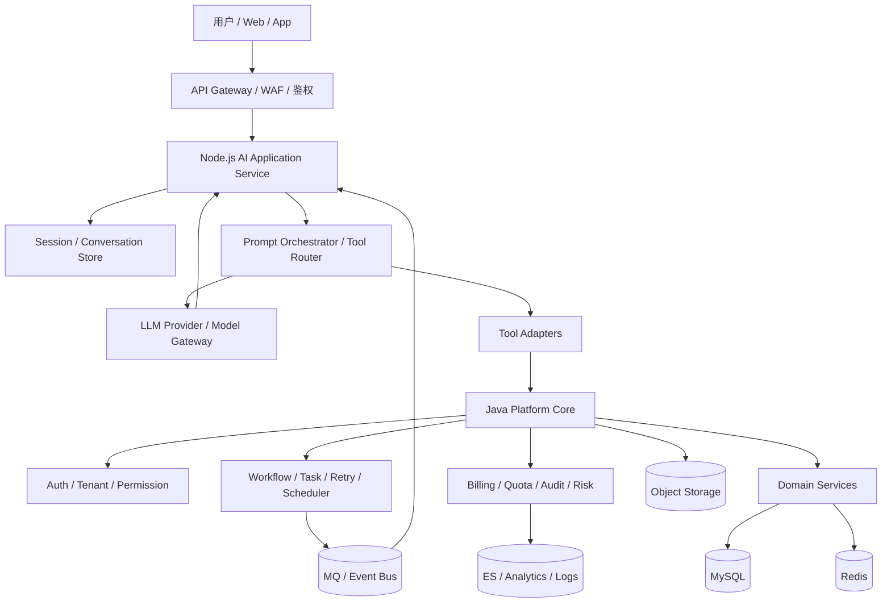

# 后端语言选择与 Node、Java、Go 对比

## 使用方式

- 它的并发模型是什么
- 它对 `I/O` 和多核 `CPU` 的利用方式是什么
- 它的类型系统、运行时、内存模型、生态和工程治理能力怎么样
- 它更像“编排型语言”“业务型语言”还是“基础设施型语言”

语言比较不能只看“谁快谁慢”，而要先看它擅长解决哪一类问题。

---

## 一、先说结论

1. 单从语言能力本身看，`Node.js` 最擅长什么？
答：它最擅长高并发连接管理、`I/O` 编排、流式输出、协议胶水层和开发效率很高的应用层服务。你可以把它理解成“非常强的事件驱动编排语言”，尤其适合把很多外部服务、浏览器端、流式接口、实时连接快速串起来。

2. 单从语言能力本身看，`Java` 最擅长什么？
答：它最擅长复杂业务建模、长期演进的大型系统、强约束工程体系、多线程并发控制和成熟中间件生态下的稳定运行。你可以把它理解成“特别强的工程化业务主干语言”。

3. 单从语言能力本身看，`Go` 最擅长什么？
答：它最擅长轻量高并发服务、网络服务、基础设施组件和资源效率比较敏感的平台型系统。你可以把它理解成“偏系统服务和平台服务的高性价比语言”。

---

## 二、从语言能力本身看三者的核心差异

4. `Node.js` 的并发模型本质是什么？
答：核心是单线程事件循环加 `libuv` 事件驱动模型。它对网络 `I/O`、文件 `I/O`、流式连接、多路复用这类场景非常自然，因为大量请求不会一请求一线程地阻塞在那里。

5. `Java` 的并发模型本质是什么？
答：传统上是多线程模型，配合线程池、锁、`CAS`、`AQS`、`NIO/Netty` 等机制；现在还有虚拟线程进一步降低并发编程成本。它不是靠“少线程编排”，而是靠成熟的线程模型和运行时把多核能力吃得更充分。

6. `Go` 的并发模型本质是什么？
答：`goroutine + channel + scheduler`。它比 `Java` 线程更轻，比 `Node.js` 更自然地利用多核，非常适合写网络服务、代理、网关和平台侧高并发模块。

7. `Node.js` 在 `I/O` 上为什么很强？
答：因为它天然适合处理大量等待型任务。请求的大部分时间都在等下游响应、等数据库、等外部模型、等磁盘、等网络，事件循环可以在等待期间继续处理别的请求，所以它在“编排很多慢外部调用”时非常顺手。

8. `Java` 在 `I/O` 上弱吗？
答：不弱，甚至在很多严肃后端场景里更强。只是 `Java` 的强不在“语法看起来更轻”，而在于它有非常成熟的 `NIO`、`Netty`、连接池、线程池、背压、序列化、观测与调优体系。你不能简单理解成“`Node` 适合 `I/O`，`Java` 不适合”，这个判断是过于粗糙的。

9. 那 `Java` 的 `I/O` 能力比 `Node.js` 强吗？
答：不能一句话说绝对强或弱，要分层看。如果是“快速写一个流式编排服务、实时推送层、BFF 层”，`Node.js` 往往开发体验更好；如果是“高吞吐、可观测、可调优、和大量中间件整合、需要长期稳定运行的网络服务”，`Java` 完全可以不弱于 `Node.js`，很多情况下还更强。

---

## 三、三门语言分别最容易遇到的短板

10. `Node.js` 的主要短板是什么？
答：它的主要短板不是“不能做后端”，而是单个进程对多核 `CPU` 的利用不如 `Java`/`Go` 直接，`CPU` 密集型任务和复杂并发控制不够舒服，超大型工程里约束力和类型安全通常也不如 `Java` 强。

11. `Java` 的主要短板是什么？
答：学习门槛和工程复杂度更高，写起来没 `Node.js` 那么轻快。很多简单编排型服务、实验型服务，用 `Java` 写会显得偏重。

12. `Go` 的主要短板是什么？
答：它在复杂业务建模、超大型企业业务系统抽象和生态厚度上通常不如 `Java`；在前后端一体化开发效率、前端协作和应用层生态上通常不如 `Node.js`。

---

## 四、按语言能力看典型适配场景

13. 什么场景更适合 `Node.js`？
答：`BFF`、实时连接管理、`WebSocket/SSE`、流式输出、API 聚合层、AI 应用编排层、工具平台、快速试错的应用服务。这些场景的共同特点是：外部调用多、业务编排多、等待时间多、响应形态偏流式。

14. 什么场景更适合 `Java`？
答：复杂业务主系统、交易链路、订单系统、权限系统、运营平台、企业平台、规则密集型服务、长期演进的大型微服务体系。这些场景更看重模型表达、类型约束、事务和一致性治理、成熟框架和长期可维护性。

15. 什么场景更适合 `Go`？
答：高性能网关、代理、调度器、基础设施服务、日志链路处理、云原生组件、平台型服务、部分 AI 服务接入层。它在“高并发网络服务 + 轻量部署 + 较低资源成本”这个组合上很突出。

16. 为什么不能把三门语言粗暴理解成“`Node` 做 `I/O`，`Java` 做稳定性，`Go` 做性能”？
答：因为这只是很粗的标签。`Node.js` 也可以做高可用服务，`Java` 也非常能做高性能 `I/O` 服务，`Go` 也能承载业务系统。更准确的说法是：三者在“开发体验、并发模型、多核利用、工程约束和生态侧重点”上不同。

---

## 五、AI 项目里为什么经常能看到 `Node.js`

17. 现在很多 AI 项目的后端是不是都在用 `Node.js`？
答：不少“AI 应用层后端”确实喜欢用 `Node.js/TypeScript`，但不能扩大成“很多 AI 后端本质上都是 Node”。更准确地说，AI 系统通常是分层的，不同层常用语言并不一样。

18. AI 系统一般分成哪几层？
答：常见可以粗分成四层：

1. 产品应用层：聊天接口、会话管理、流式返回、工具编排、前后端一体化，这层常见 `Node.js/TypeScript`
2. 模型接入层：模型代理、鉴权、配额、路由，这层常见 `Go`、`Java`、`Node.js`
3. 算法与推理层：训练、推理、向量处理、数据科学，这层常见 `Python`
4. 平台治理层：任务调度、审计、计费、权限、工作流、运营后台，这层常见 `Java`、`Go`

19. 为什么 AI 应用层会偏爱 `Node.js`？
答：因为 AI 应用经常要处理流式输出、长连接、工具调用编排、第三方 API 串联、前后端同构协作和快速试错，这正是 `Node.js` 的舒适区。它特别像一个“把很多外部能力快速粘起来”的应用层语言。

20. 那是不是说明 `Node.js` 比 `Java` 更适合 AI？
答：不是。只能说明它在 AI 应用层、编排层、实时交互层很强；但如果是 AI 平台治理、计费、审批、任务系统、审计、复杂业务主干，`Java` 往往仍然非常合适，甚至更合适。

21. 你提到的 `openclaw` 这类项目说明了什么？
答：它更能说明 `Node.js/TypeScript` 在 AI 产品应用层和工程集成层的优势明显，而不是说明“AI 后端最后都会收敛到 Node”。很多 AI 产品表层是 `Node`，底下实际仍然会配合 `Python`、`Go`、`Java` 或数据库、中间件共同完成。

---

## 六、`Java` 真正的强项到底是什么

22. `Java` 的强项是不是只是“稳定”？
答：不是。说 `Java` 只是“稳定”太浅了。它真正的强项是：复杂业务建模能力、强类型约束、成熟并发工具箱、`JVM` 运行时优化能力、海量中间件生态、超大规模工程协作能力。

23. 为什么复杂业务系统特别容易用 `Java`？
答：因为复杂业务不是只有接口调用，还会涉及状态机、权限、事务、一致性、领域模型、异常边界和长期演进。`Java` 在抽象层次、代码组织、类型约束和框架支撑上，对这类问题非常友好。

24. `Java` 对多核 `CPU` 的利用为什么通常比 `Node.js` 更直接？
答：因为 `Java` 天然就是成熟的多线程运行时，线程池、锁、无锁并发结构、并行计算、异步编排都很丰富。`Node.js` 不是不能利用多核，但通常没有 `Java` 这么直接、这么自然。

25. `Java` 的 `I/O` 强项到底体现在哪？
答：体现在成熟网络框架、连接池、异步 `I/O`、背压控制、序列化生态、线程模型调优、监控诊断和长期稳定运行能力上。也就是说，`Java` 的 `I/O` 强不只是“能处理请求”，而是“能在复杂系统里把请求处理得更稳、更可观测、更可治理”。

26. `Java` 最适合扮演什么角色？
答：最适合扮演业务主干、平台主干、治理主干。尤其当系统已经不只是“把几个接口串起来”，而是需要长期演进、多人协作、严格治理时，`Java` 的优势会越来越明显。

---

## 七、最成熟的比较维度应该是什么

1. 并发模型
2. `I/O` 处理方式
3. 多核 `CPU` 利用能力
4. 类型系统和大型工程约束能力
5. 运行时与调优能力
6. 生态和中间件成熟度
7. 最适合承载的系统类型

28. 为什么语言比较题本质上也是系统设计题？
答：因为你最终还是在回答：这个系统是偏编排、偏业务、偏平台还是偏基础设施；它需要的是快速试错、强治理、低资源还是强约束。语言只是这些约束的一个落点。

---

## 八、一个 `Node.js + Java` 的 AI 项目混合后端架构

29. 如果做一个 AI 项目，`Node.js + Java` 最合理的分工是什么？
答：一个很成熟的思路是：

- `Node.js` 负责用户交互层、流式接口层、AI 编排层
- `Java` 负责业务主干、平台治理层、任务与数据一致性层

也就是说，不要让 `Node.js` 一肩挑起所有事情，也不要让 `Java` 去硬扛最前面的流式交互体验层。两者各做最擅长的部分。

30. 一个具体的架构图可以怎么画？
答：可以参考下面这个分层：

31.  `Node.js` 具体负责什么？
答：主要负责四类事：

1. `HTTP/WebSocket/SSE` 接入和流式输出
2. 会话上下文拼装、提示词编排、工具调用编排
3. 多模型、多工具、多下游接口的应用层路由
4. 把用户请求快速转成“可执行的 AI 任务”

这部分本质上是“高 `I/O`、强交互、快迭代”的应用层，非常适合 `Node.js`。

32. 这个图里 `Java` 具体负责什么？
答：主要负责六类事：

1. 用户、租户、权限、组织边界
2. 业务主数据和核心领域服务
3. 任务状态机、异步任务、补偿、重试、调度
4. 配额、计费、审计、风控、内容审核
5. 文件、对象存储、产物元数据治理
6. 事件一致性、消息投递、数据沉淀和报表

这部分本质上是“复杂业务 + 强治理 + 长周期演进”的平台主干，非常适合 `Java`。

33. 一个典型请求链路可以怎么走？
答：比如“用户发起一次 AI 对话并触发工具调用”，可以这样走：

1. 用户请求先进入网关，再到 `Node.js`
2. `Node.js` 做会话上下文组装、提示词构造、模型路由
3. 如果只是普通问答，`Node.js` 可以直接请求模型并流式返回
4. 如果涉及业务动作，比如查知识库、提交审批、创建任务、扣配额，`Node.js` 调用 `Java` 平台接口
5. `Java` 落业务状态、写数据库、记审计、扣配额，必要时投递异步事件
6. `Node.js` 继续把中间结果或最终结果流式返回给用户

34. 为什么不让 `Java` 直接处理最前面的流式对话？
答：不是不能，而是很多 AI 产品前层的需求变化非常快，涉及流式 token 输出、工具链编排、前后端协作、协议适配，这一层用 `Node.js/TypeScript` 往往更敏捷。

35. 为什么又不能只用 `Node.js`？
答：因为一旦项目进入平台化阶段，你很快会碰到权限、租户、配额、计费、审计、工作流、任务补偿、报表、后台治理。这些不是简单 API 编排问题，而是复杂业务系统问题，通常 `Java` 会更稳。

36. 这种架构最适合什么类型的 AI 项目？
答：特别适合下面几类：

- 带聊天和流式输出的 AI 应用
- 有多租户、配额、计费和权限的 AI SaaS
- 有文档上传、知识库、任务执行和产物管理的 AI 平台
- 既强调用户体验，又强调后台治理的企业级 AI 系统

37. 这种架构最容易踩什么坑？
答：最常见有四个坑：

1. 把 `Node.js` 写成“第二个业务后端”，导致业务规则分散
2. 把 `Java` 写得离用户交互太近，导致流式体验和迭代效率变差
3. 两边领域边界不清，接口语义混乱
4. 事件、回调、异步任务没有统一状态机和审计链路

38. 最成熟的边界原则是什么？
答：一句话总结就是：

- `Node.js` 负责交互、编排、流式体验
- `Java` 负责业务、治理、状态一致性

谁更接近“用户交互编排”，谁更接近 `Node.js`；谁更接近“平台规则和核心数据”，谁更接近 `Java`。

39. 如果映射到 `agent-server-java` 这种项目里，可以怎么拆？
答：可以这样理解：

- `Node.js`：聊天入口、流式响应、Agent 工具编排、前端接口聚合
- `Java`：用户体系、租户权限、知识库元数据、任务状态机、配额计费、审计日志、通知与回调治理

---

## 九、这一篇学到位的标准

学完这篇，你至少要做到下面三件事：

1. 能从并发模型、`I/O`、多核利用、类型系统和工程治理角度比较 `Node.js`、`Java`、`Go`。
2. 能解释为什么很多 AI 应用层喜欢 `Node.js`，但这不等于 `Node.js` 统治整个 AI 后端。
3. 能说清 `Java` 的真正强项不是一句“稳定”，而是复杂业务主干和大型工程体系能力。
